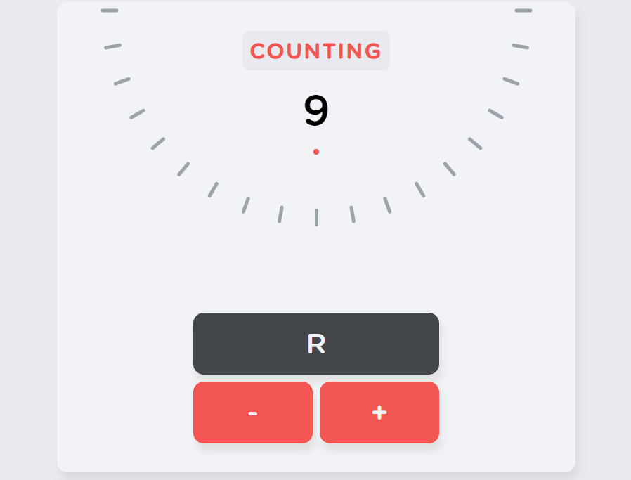

# 🔢 Counter Application

A simple web page with a functional counter that allows users to increment, decrement, or reset the counter using three buttons. This project is built using **HTML**, **CSS**, and **JavaScript** to provide a clean and responsive design.

## 🚀 Features

-   **Increment Button (+):** Increases the counter value by 1.
-   **Decrement Button (-):** Decreases the counter value by 1.
-   **Reset Button:** Resets the counter to 0.
-   Responsive layout suitable for mobile and desktop devices.

## 🛠️ Technologies Used

-   **HTML**: For the basic structure of the page.
-   **CSS**: For styling and layout.
-   **JavaScript**: For handling the functionality of the buttons and counter logic.

## 📋 Usage

1. Clone the repository:

    ```bash
    git clone https://github.com/ViorelsS/JS_Counter.git
    ```

2. Open the `index.html` file in your browser to view and interact with the counter.

## 📱 Known Bugs

-   **iOS and iPadOS Rendering Issues:**  
    On devices running iOS and iPadOS, the rotation of the thick markers (visual indicators) sometimes appears jittery, and they may disappear momentarily during transitions. Despite several attempts to address this, no definitive solution has been found yet. This issue seems to be related to how these devices handle CSS transforms during rotations.

## 🌐 Deployment

The project has been deployed using **Netlify** and can be accessed [here](https://viorelss-counter.netlify.app/).

## 🤝 Contributing

Contributions are welcome! If you'd like to enhance the project or fix bugs, feel free to fork the repository, create a new branch, and submit a pull request.

1. Fork the project.
2. Create a new branch (`git checkout -b feature/YourFeature`).
3. Commit your changes (`git commit -m 'Add new feature'`).
4. Push to the branch (`git push origin feature/YourFeature`).
5. Open a pull request.

---

### 🖼️ Project Screenshot

<div align="center">
  
</div>
